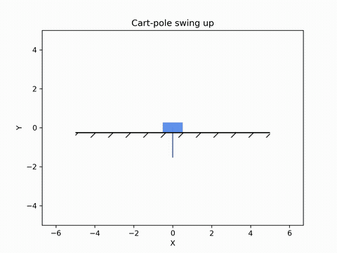

# Trajectory optimization with direct collocation

This is a Python implementation of a trajectory optimizer based on direct collocation [[1]](#1), using [Jax](https://docs.jax.dev/en/latest/) for automatic differentiation and [IPOPT](https://coin-or.github.io/Ipopt/) for optimization.
It supports trapezoidal and Hermite-Simpson collocation, as well as an experimental implementation of Betts' mesh refinement method [[2]](#2).

## Example application: Cart-pole swing up

We consider a [cart-pole system](https://openmdao.github.io/dymos/examples/cart_pole/cart_pole.html) consisting of a freely rotating pole attached to a cart:
the system can only be controlled by exerting a horizontal force on the cart.
In this system, we pose an optimal control problem (OCP) where, starting from the pole balanced at the bottom, the pole must be balanced at the top only by exerting forces on the cart.
In addition to satisfying these constraints, we aim to minimize the accumulated control effort ($u(t)^2$) over the trajectory.

The GIF below shows a simulation applying in open loop the control sequence generated by the trajectory optimizer.

  

As we can see, the generated control sequence successfully swings the pole up to the balanced position, all while minimizing the control effort.

> **Warning**
> In this example, applying the control sequence in open loop yields the desired behavior, but generally it is not guaranteed that this will be the case:
> in order to make the generated trajectory locally stable, we would need a low-level [tracking controller](https://underactuated.csail.mit.edu/trajopt.html#section5) to follow the trajectory in closed loop.

## What is direct collocation?

We aim to solve a continuous-time optimal control problem (OCP) defined by

$$
\min_{x(t),\,u(t)} \int_{t_0}^{t_f} L(x(t), u(t), t)\, \text{d}t + L_f(x(t_0), x(t_f), t_0, t_f)
$$

subject to

$$
\dot{x}(t) = f(x(t), u(t), t),
$$

where $x(t)$ is the state, $u(t)$ the control, $f$ the system dynamics, $L$ the running cost and $L_f$ is the terminal cost.
We can also impose additional constraints on the whole trajectory and/or initial/final states.

Direct collocation converts the continuous-time optimal control problem into a finite-dimensional nonlinear program (NLP) by discretizing the state and control trajectories at a set of grid points, then enforcing the system dynamics only at those points.
We discretize the time interval $[t_0, t_f]$ into $N-1$ intervals over a grid of $N$ points, placed at fixed fractions of the horizon so that $t_k = t_0 + \tau_k (t_f - t_0)$.
The states and controls at the grid points, $x_k \approx x(t_k)$ and $u_k \approx u(t_k)$, together with the free endpoint times $t_0, t_f$, become the NLP decision variables.

In order to convert the continuous OCP into an NLP, instead of integrating $f$ forward as in [shooting methods](https://en.wikipedia.org/wiki/Shooting_method), collocation enforces the ODE only implicitly through _defect constraints_, requiring the discretized trajectory to satisfy system dynamics at each segment.

### Collocation methods

Here we implement _trapezoidal_ and _Hermite-Simpson_ collocation.
In what follows we denote $h_k = t_{k+1} - t_k$ the duration of the time interval at the $k$-th segment.

#### Trapezoidal collocation

Trapezoidal collocation uses only the grid points $x_k, u_k, t_k$, with $\dot x_k := f(x_k, u_k, t_k)$. The defect constraints are

$$
x_{k+1} - x_k - \frac{h_k}{2}\Big(\dot{x}_{k+1} + \dot{x}_k\Big) = 0,
$$

and the integrated running cost is approximated by

$$
\sum_{k=0}^{N-2} \frac{h_k}{2}\Big(L(x_k,u_k,t_k) + L(x_{k+1},u_{k+1},t_{k+1})\Big).
$$

#### Hermite-Simpson collocation

Hermite-Simpson adds a midpoint control $u_{k+1/2}$ as an extra decision variable, and a midpoint state $x_{k+1/2}$ computed from a cubic Hermite fit, thus given by

$$
x_{k+1/2} = \frac{1}{2}(x_k + x_{k+1}) + \frac{h_k}{8}\Big(\dot{x}_k - \dot{x}_{k+1}\Big),
$$

with $t_{k+1/2} = t_k + h_k/2$ and $\dot{x}_{k+1/2} := f(x_{k+1/2}, u_{k+1/2}, t_{k+1/2})$.

The defect constraints are

$$
x_{k+1} - x_k - \frac{h_k}{6}\Big(\dot{x}_{k+1} + 4\dot{x}_{k+1/2} + \dot{x}_k\Big) = 0,
$$

and we approximate the running cost by

$$
\sum_{k=0}^{N-2} \frac{h_k}{6}\Big(L(x_k,u_k,t_k) + 4L(x_{k+1/2},u_{k+1/2},t_{k+1/2}) + L(x_{k+1},u_{k+1},t_{k+1})\Big).
$$

## Mesh refinement

Because accuracy depends on $h_k$, a fixed grid can be too coarse in some intervals and too fine in others.
The OCP solving routine thus estimates a per-interval discretization error, comparing the true dynamics $f$ against the trajectory's local polynomial approximation.
Then, following Betts' method, mesh refinement either raises the collocation order (from trapezoidal to Hermite-Simpson) or adds grid points in the highest-error intervals, re-solving until the maximum error is below a certain tolerance or a maximum number of iterations is reached.

---

## Resources and references

<a id="1">[1]</a>
Kelly, Matthew. "An introduction to trajectory optimization: How to do your own direct collocation." SIAM review 59.4 (2017): 849-904.

<a id="2">[2]</a>
Betts, John T. Practical methods for optimal control and estimation using nonlinear programming. Society for Industrial and Applied Mathematics, 2010.
